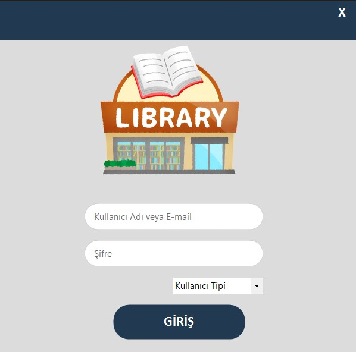
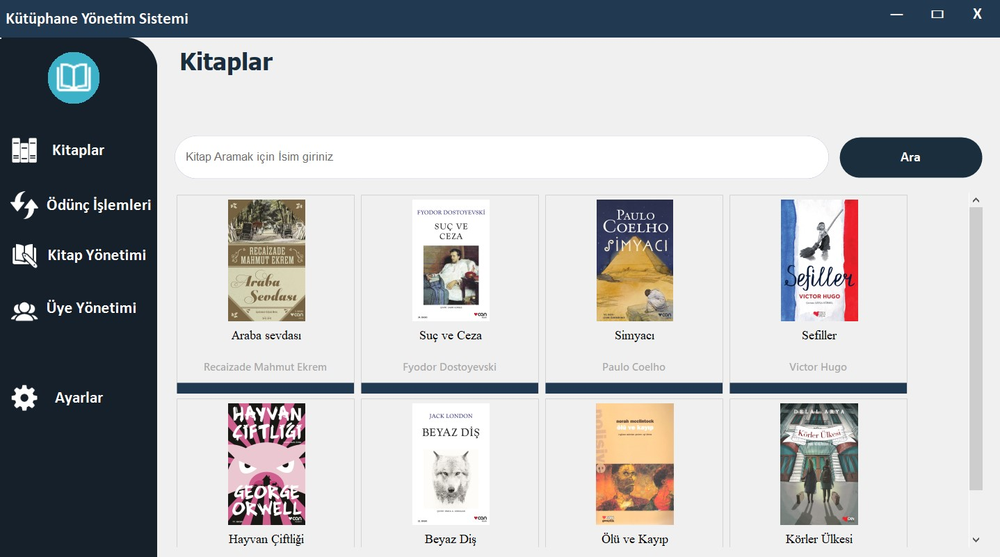
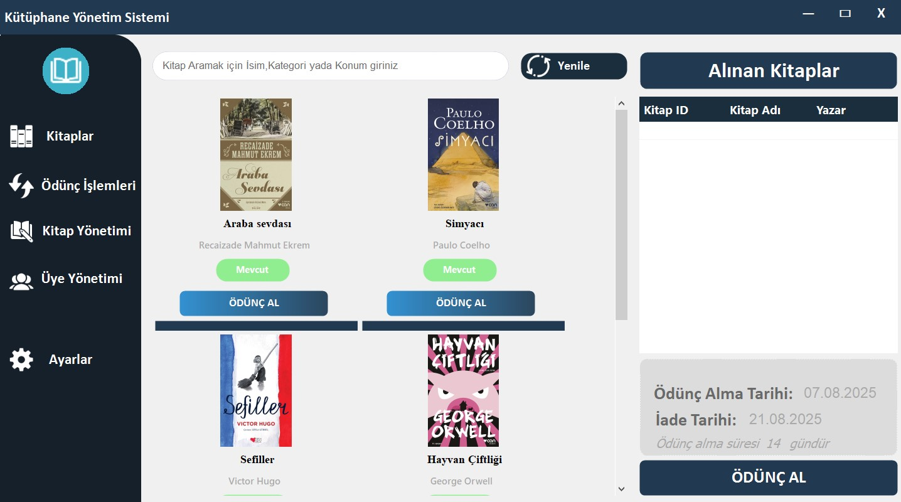
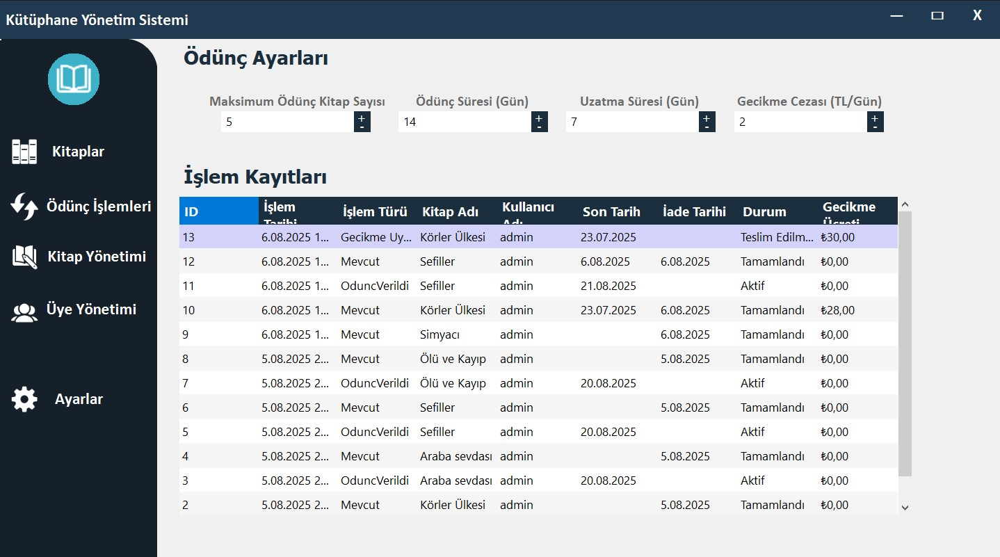

# 📚 Kütüphane Yönetim Sistemi






> 🎯 Gelişmiş ve modüler yapıda geliştirilmiş bir **Windows Forms Kütüphane Yönetim Sistemi**

## ✨ Özellikler

### 📖 Kitap Yönetimi
- Kitap ekleme, düzenleme ve silme
- Kategori ve konum bilgisi yönetimi
- Kitap resmi ve stok takibi

### 👥 Kullanıcı Yönetimi
- Rol bazlı erişim kontrolü (Admin, Personel)
- Güvenli kullanıcı girişi
- Aktivite ve işlem geçmişi takibi

### 📋 Ödünç İşlemleri
- Kitap ödünç alma ve iade etme
- Otomatik ödünç süresi hesaplama
- Gecikme ve ceza hesaplama sistemi

## 🚀 Kurulum

### Gereksinimler
- [.NET 6.0 SDK](https://dotnet.microsoft.com/en-us/download/dotnet/6.0)
- [SQL Server 2019](https://www.microsoft.com/en-us/sql-server/sql-server-downloads)
- [Visual Studio 2022](https://visualstudio.microsoft.com/)

### Kurulum Adımları
1. Bu repoyu klonlayın:
   ```bash
   git clone https://github.com/kullaniciadi/LibraryManagementSystem.git
   ```
2. SQL Server üzerinde `LibraryDb` adında bir veritabanı oluşturun.
3. `appsettings.json` dosyasındaki `DefaultConnection` alanına kendi bağlantı dizesini yazın.
4. Aşağıdaki komutla veritabanını oluşturun:
   ```bash
   dotnet ef database update
   ```
5. Visual Studio üzerinden projeyi açın ve `F5` tuşuyla çalıştırın.

### Varsayılan Giriş Bilgileri
- **Kullanıcı Adı**: `admin`
- **Şifre**: `123`

## 🏗️ Proje Yapısı

```
LibraryManagementSystem/
├── Library.Business/          # İş mantığı (Servis ve yönetici sınıflar)
├── Library.DataAccess/        # Veri erişim katmanı (EF, Repository)
├── Library.Entities/          # Varlık sınıfları (Entity modelleri)
├── Library.WebFormsUI/        # Kullanıcı arayüzü (Windows Forms)
└── LibraryApp.Utilities/      # Ortak yardımcı sınıflar ve araçlar
```

## 🔧 Teknolojiler ve Yapılar

- Katmanlı Mimari (UI, Business, DataAccess, Entities, Utilities)
- Entity Framework Core
- FluentValidation ile doğrulama
- Dependency Injection ile bağımlılık enjeksiyonu
- Repository Pattern ile veri erişim soyutlaması
- Event handler kullanımı


## 📌 Notlar

- Kullanıcı doğrulama ve giriş işlemleri güvenlidir.
- Yeni modüllerin kolayca entegre edilebilmesi için genişletilebilir bir mimariyle tasarlanmıştır.
- Kod yapısı temiz, sürdürülebilir ve test edilebilir şekilde organize edilmiştir.

## 📬 Katkı Sağlamak İster misiniz?

Her türlü katkı, öneri ve pull request memnuniyetle karşılanır. Projeyi birlikte daha iyi bir noktaya taşıyabiliriz. ⭐

**[⬆ Yukarı Dön](#kütüphane-yönetim-sistemi)**
